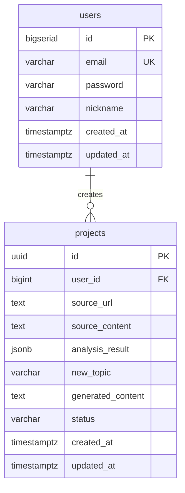

# 📊 CopyCat Database Schema

本文档定义了 CopyCat MVP 阶段的核心数据模型。

---

## 1. users (用户表)

存储用户基本信息，用于 MVP 阶段的简单用户系统。

| 字段名        | 类型           | 约束                      | 说明                     |
| ------------- | -------------- | ------------------------- | ------------------------ |
| `id`          | `BIGSERIAL`    | `PRIMARY KEY`             | 用户唯一 ID (自增)       |
| `email`       | `VARCHAR(255)` | `UNIQUE NOT NULL`         | 用户邮箱 (用于登录)      |
| `password`    | `VARCHAR(255)` | `NOT NULL`                | 密码哈希                 |
| `nickname`    | `VARCHAR(100)` |                           | 用户昵称                 |
| `created_at`  | `TIMESTAMPTZ`  | `DEFAULT NOW()`           | 创建时间                 |
| `updated_at`  | `TIMESTAMPTZ`  | `DEFAULT NOW()`           | 更新时间                 |

### 索引
- `idx_users_email` ON `email`

---

## 2. projects (创作项目表)

记录用户的每一次创作历史，包含爬取内容、分析结果和生成的仿写文案。

| 字段名             | 类型           | 约束                                 | 说明                             |
| ------------------ | -------------- | ------------------------------------ | -------------------------------- |
| `id`               | `UUID`         | `PRIMARY KEY DEFAULT gen_random_uuid()` | 项目唯一 ID (UUID)              |
| `user_id`          | `BIGINT`       | `NOT NULL REFERENCES users(id)`      | 关联用户 ID                      |
| `source_url`       | `TEXT`         |                                      | 原始文案来源 URL (小红书/公众号) |
| `source_content`   | `TEXT`         | `NOT NULL`                           | 爬取/输入的原始文案内容          |
| `analysis_result`  | `JSONB`        |                                      | LLM 分析结果 (情绪/结构/关键词)  |
| `new_topic`        | `VARCHAR(500)` |                                      | 用户输入的新主题                 |
| `generated_content`| `TEXT`         |                                      | LLM 生成的仿写文案               |
| `status`           | `VARCHAR(50)`  | `DEFAULT 'draft'`                    | 项目状态 (draft/analyzed/completed) |
| `created_at`       | `TIMESTAMPTZ`  | `DEFAULT NOW()`                      | 创建时间                         |
| `updated_at`       | `TIMESTAMPTZ`  | `DEFAULT NOW()`                      | 更新时间                         |

### 索引
- `idx_projects_user_id` ON `user_id`
- `idx_projects_status` ON `status`
- `idx_projects_created_at` ON `created_at DESC`

---

## 3. analysis_result JSONB 结构示例

```json
{
  "emotion": {
    "primary": "excited",       // 主要情绪
    "intensity": 0.85           // 情绪强度 (0-1)
  },
  "structure": {
    "hook": "引人注目的开头...",        // 开头勾子
    "body_style": "list",              // 正文风格 (list/narrative/qa)
    "cta": "快来试试吧！"              // 行动号召
  },
  "keywords": ["爆款", "种草", "必买"], // 核心关键词
  "tone": "casual",                    // 语气 (casual/formal/humorous)
  "word_count": 350                    // 原文字数
}
```

---

## 4. 表关系图 (ER Diagram)



---

## 5. PostgreSQL 建表 DDL

```sql
-- 启用 UUID 扩展 (如果尚未启用)
CREATE EXTENSION IF NOT EXISTS "pgcrypto";

-- 用户表
CREATE TABLE users (
    id            BIGSERIAL PRIMARY KEY,
    email         VARCHAR(255) UNIQUE NOT NULL,
    password      VARCHAR(255) NOT NULL,
    nickname      VARCHAR(100),
    created_at    TIMESTAMPTZ DEFAULT NOW(),
    updated_at    TIMESTAMPTZ DEFAULT NOW()
);

CREATE INDEX idx_users_email ON users(email);

-- 项目表
CREATE TABLE projects (
    id                 UUID PRIMARY KEY DEFAULT gen_random_uuid(),
    user_id            BIGINT NOT NULL REFERENCES users(id) ON DELETE CASCADE,
    source_url         TEXT,
    source_content     TEXT NOT NULL,
    analysis_result    JSONB,
    new_topic          VARCHAR(500),
    generated_content  TEXT,
    status             VARCHAR(50) DEFAULT 'draft',
    created_at         TIMESTAMPTZ DEFAULT NOW(),
    updated_at         TIMESTAMPTZ DEFAULT NOW()
);

CREATE INDEX idx_projects_user_id ON projects(user_id);
CREATE INDEX idx_projects_status ON projects(status);
CREATE INDEX idx_projects_created_at ON projects(created_at DESC);
```
